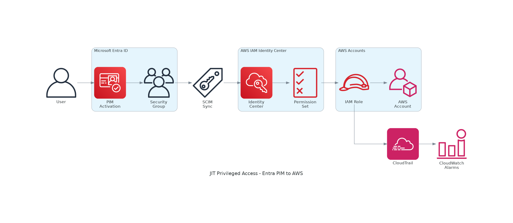

# Just-in-Time Privileged Access to AWS with Microsoft Entra PIM

[](https://opensource.org/licenses/MIT)
[](https://www.terraform.io/)
[](https://registry.terraform.io/providers/hashicorp/aws/latest)

Implementation of Just-in-Time (JIT) privileged access to AWS using Microsoft Entra Privileged Identity Management (PIM) integrated with AWS IAM Identity Center.

> Based on [AWS Security Blog: Implementing just-in-time privileged access to AWS](https://aws.amazon.com/blogs/security/implementing-just-in-time-privileged-access-to-aws-with-microsoft-entra-and-aws-iam-identity-center/)

## Architecture



### Additional Diagrams

| Diagram | Description |
|---------|-------------|
| [Data Flow](diagrams/data-flow.png) | Step-by-step access flow |
| [Session Timeline](diagrams/session-timeline.png) | Timeline from request to revocation |
| [Multi-Account](diagrams/multi-account.png) | AWS Organization setup |
| [Security Controls](diagrams/security-controls.png) | Security layers and monitoring |

## Features

- ✅ Time-bound access (1-24 hours)
- ✅ Approval workflow (optional)
- ✅ MFA enforcement
- ✅ Justification tracking
- ✅ Audit logging
- ✅ Automatic provisioning via SCIM
- ✅ Permissions boundary for privilege escalation prevention
- ✅ CloudWatch monitoring (optional)
- ✅ Terraform automation

## Prerequisites

| Component | Requirement |
|-----------|-------------|
| AWS | Organization instance of IAM Identity Center |
| Azure | Entra ID P1 or P2 licensing |
| Integration | SAML + SCIM configured |
| Terraform | >= 1.6 |

## Session Duration

| Setting | Default | Range | Notes |
|---------|---------|-------|-------|
| AWS access portal session | 8 hours | 15 mins - 90 days | User interactive session |
| Permission set session | 1 hour | 1 - 12 hours | Per permission set |
| PIM activation duration | 8 hours | 30 mins - 24 hours | Per group |

> ⚠️ **Important**: Active sessions are NOT terminated when PIM expires. Potential access window = PIM duration + sync delay (~10 mins) + session duration.

## Quick Start

### Manual Setup

1. [Configure SAML & SCIM](docs/01-saml-scim-setup.md)
2. [Create Security Groups](docs/02-security-groups.md)
3. [Configure Permission Sets](docs/03-permission-sets.md)
4. [Enable PIM for Groups](docs/04-pim-configuration.md)
5. [Test & Validate](docs/05-testing.md)

### Terraform Deployment

```bash
cd terraform
cp terraform.tfvars.example terraform.tfvars
# Edit terraform.tfvars with your values
terraform init
terraform plan
terraform apply
```

## Documentation

| Document | Description |
|----------|-------------|
| [Architecture](docs/architecture.md) | Solution architecture and data flow |
| [Best Practices](docs/best-practices.md) | Recommended configurations |
| [Security Best Practices](docs/security-best-practices.md) | Security guidelines |
| [Security Checklist](docs/security-checklist.md) | Compliance checklist |
| [Troubleshooting](docs/troubleshooting.md) | Common issues and solutions |

## Limitations

- Nested groups not supported with SCIM
- Dynamic groups supported but don't flatten nested groups
- Attribute removal in Entra doesn't sync to IAM Identity Center
- SCIM sync can take 2-40 minutes depending on load
- Multi-value attributes (multiple emails, phones) not supported
- SCIM token expires after 1 year - rotate before expiration

## References

### AWS Documentation
- [AWS Blog: Implementing JIT privileged access](https://aws.amazon.com/blogs/security/implementing-just-in-time-privileged-access-to-aws-with-microsoft-entra-and-aws-iam-identity-center/)
- [Configure SAML and SCIM with Microsoft Entra ID](https://docs.aws.amazon.com/singlesignon/latest/userguide/idp-microsoft-entra.html)
- [IAM Identity Center User Guide](https://docs.aws.amazon.com/singlesignon/latest/userguide/what-is.html)

### Microsoft Documentation
- [PIM for Groups](https://learn.microsoft.com/en-us/entra/id-governance/privileged-identity-management/pim-configure)
- [Entra ID SCIM Provisioning](https://learn.microsoft.com/en-us/azure/active-directory/app-provisioning/how-provisioning-works)

## Contributing

Contributions are welcome! Please read [CONTRIBUTING.md](CONTRIBUTING.md) for details.

## License

This project is licensed under the MIT License - see the [LICENSE](LICENSE) file for details.

## Acknowledgments

- AWS Security Blog team for the original architecture
- Microsoft Entra documentation team
